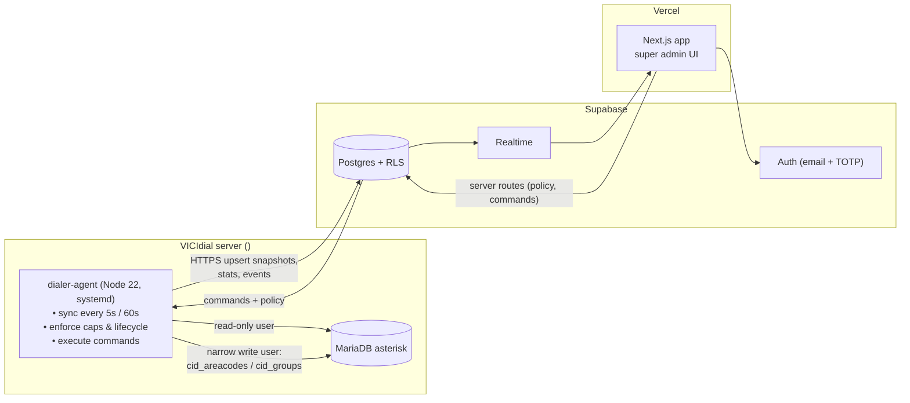

# Dialer Control: New Repo Plan

**Status:** Draft to start a new repo · **Prepared:** 2026-09-17 · **Owner:** Umar Masood
**Audience:** super admin only (you), no tenants, no agents logging in.

**What it is:** a small internal web app to watch and steer the VICIdial dialer (`<dialer-host>`, <dialer-ip>):

1. **Number health:** every caller-ID DID, its state, calls today, answer rate, short-call %, carrier rejects, spam checks.
2. **Rotation in real time:** which DIDs are allowed to dial right now, caps per DID, automatic warm-up / cool-off / return, manual pause.
3. **Live agents:** who is logged in, READY / INCALL / PAUSED, current call, calls today.
4. **Later:** campaigns (pacing, hours, statuses) and data (lists, lead loading, recycling).

Related: predictive rollout plan (DID lifecycle thresholds, published separately).

> **Design rule:** the dialer must stay safe even if this app, Vercel or Supabase is down. Rotation caps are enforced by a small **agent on the dialer server** using the last known policy. The web app only *shows* state and *changes* policy.

---

## 1. Ground truth (verified on the dialer, 2026-09-15 to 09-17)

| Fact | Detail | Impact on this app |
|---|---|---|
| VICIdial 2.14b0.5, SVN 4027, schema 1745 | MariaDB local only (no remote bind), no Node installed | Data must be read **on the server**, so we ship a small sync agent |
| **CID per call is logged** | `vicidial_dial_cid_log(caller_code, call_date, call_type, call_alt, outbound_cid, outbound_cid_type)` | Join `caller_code` → `vicidial_log_extended.uniqueid` → `vicidial_log` (status, length) for per-DID outcomes |
| SIP result per call | `vicidial_dial_log(outbound_cid, sip_hangup_cause, sip_hangup_reason, uniqueid)`, `vicidial_log_extended_sip(invite_to_ring, ring_to_final, last_event_code)` | Carrier rejects (e.g. `503`, `603`, `608 Rejected` = analytics block) per DID |
| Carrier log | `servers.carrier_logging_active = Y` but `vicidial_carrier_log` has **0 rows** | Investigate in Phase 0 (likely the custom TELEINX dial plan bypasses the logging AGI) |
| Rotation tables exist, empty | `vicidial_campaign_cid_areacodes(campaign_id, areacode, outbound_cid, active, cid_description, call_count_today)` and `vicidial_cid_groups(... cid_group_type AREACODE/STATE/NONE, cid_auto_rotate_*)` — both 0 rows | The agent controls rotation by flipping `active` Y/N; VICIdial picks the least-used active CID per area code |
| **Blocker** | TELEINX dial plan hard-codes `Set(CALLERID(all)="UnlimitedDialer" <<current-caller-id>>)`; current calls log `outbound_cid = 0000000000`, type `CAMPAIGN_CID` | Remove before rotation works (Phase 0) |
| Live agents | `vicidial_live_agents(user, status, campaign_id, lead_id, calls_today, last_state_change, pause_code, …)`, `vicidial_auto_calls` | Live agent board source |
| Carrier (Teleinx, 2026-09-16 email) | DIDs $0.25 MRC + $0.25 NRC; **A-attestation only on Teleinx DIDs, C on anything else**; 300 channels / 30 CPS; spam remediation is on us; suggests mycallscore.com | Only Teleinx DIDs enter the pool; reputation checks are our job |

---

## 2. Architecture



**Why an agent on the dialer instead of the web app querying MySQL:**
- MySQL stays closed to the internet (no new attack surface).
- Rotation keeps working if Vercel or Supabase is unreachable (the agent caches the last policy locally and keeps enforcing caps).
- Sub-second reads of `vicidial_live_agents` without API polling load on VICIdial.

**Data direction:**
- **Agent → Supabase:** live agents snapshot (every 5 s), per-DID rolling counters (every 60 s), daily rollups, call facts (optional), heartbeats, command results.
- **Web → Supabase → Agent:** policy (caps, thresholds), DID inventory changes, manual commands (pause DID, force cool-off, return to warming). The agent subscribes via Realtime **and** polls every 10 s as a fallback.

---

## 3. Stack & repo layout

| Layer | Choice | Notes |
|---|---|---|
| Monorepo | pnpm workspaces | Shared types and thresholds between web and agent |
| Web | Next.js (latest, App Router) + React + TypeScript | New Next versions have breaking changes: read `node_modules/next/dist/docs/` before coding (same rule as Insurvas) |
| UI | Tailwind + shadcn/ui, Recharts for sparklines | Keep it plain; dense tables |
| Auth | Supabase Auth (email + password + **TOTP MFA required**), single `admins` allowlist | Unlike Insurvas, this repo *can* use Supabase Auth, since it's one internal user; enables RLS on `auth.uid()` and Realtime |
| DB | Supabase Postgres, SQL migrations via Supabase CLI | RLS on every table: `is_admin()` |
| Realtime | Supabase Realtime (postgres_changes) | Live agents + DID state tiles |
| Agent | Node 22 + TypeScript, `mysql2`, `@supabase/supabase-js`, systemd unit, `/etc/dialer-agent.env` (root 600) | Install Node 22 via `dnf module` on AlmaLinux 9 |
| Hosting | Vercel (web), Supabase Cloud | Web never talks to the dialer directly |
| Tests | Vitest for policy engine (pure functions); `verify:*` scripts with SQL checks | Policy engine is the part that must be right |

```
dialer-control/
├─ apps/
│  ├─ web/                  # Next.js super-admin UI
│  │  ├─ app/(auth)/login
│  │  ├─ app/(admin)/overview
│  │  ├─ app/(admin)/numbers        # list + [id] detail
│  │  ├─ app/(admin)/rotation       # policy + live CID usage
│  │  ├─ app/(admin)/agents         # live board
│  │  ├─ app/(admin)/settings       # thresholds, dialer connection, admins
│  │  └─ app/api/...                # route handlers (policy, commands, CSV import)
│  └─ agent/                # runs on the dialer server
│     ├─ src/sync/          # live agents, did stats, rollups
│     ├─ src/enforce/       # caps + lifecycle transitions
│     ├─ src/commands/      # command executor
│     └─ deploy/dialer-agent.service
├─ packages/
│  ├─ policy/               # pure lifecycle + cap logic (shared, unit-tested)
│  └─ db-types/             # generated Supabase types
├─ supabase/migrations/
└─ docs/
```

---

## 4. Data model (Supabase)

| Table | Purpose / key columns |
|---|---|
| `admins` | `user_id` (auth.users), `email`, `created_at`. RLS helper `is_admin()` |
| `dialers` | `id`, `name`, `host`, `last_heartbeat_at`, `agent_version`, `status` (one row now) |
| `dids` | `id`, `e164`, `area_code`, `state`, `carrier` (`teleinx`), `attestation` (`A` expected), `state_code` lifecycle: `NEW / WARMING / ACTIVE / COOLING / RETIRED`, `state_since`, `warmup_week`, `daily_cap`, `hourly_cap`, `manual_hold` (bool + reason), `fcr_registered_at`, `cnam`, `inbound_route_ok`, `purchased_at`, `mrc_cents`, `notes` |
| `did_state_events` | `did_id`, `from_state`, `to_state`, `reason`, `actor` (`agent` / admin email), `metrics` jsonb, `created_at` (audit trail = good-faith evidence) |
| `did_stats_live` | one row per DID: `calls_today`, `calls_last_hour`, `answered_today`, `short_calls_today`, `drops_today`, `sip_4xx_6xx_today`, `last_call_at`, `updated_at` (agent upserts every 60 s) |
| `did_stats_daily` | `did_id`, `day`, `calls`, `answered`, `human_answer_rate`, `short_call_pct`, `avg_talk_sec`, `drops`, `sip_603`, `sip_608`, `sip_503`, `unique_numbers` |
| `reputation_checks` | `did_id`, `source` (`mycallscore`, `hiya`, `handset_att`, `handset_vzw`, `handset_tmo`, `manual`), `label` (`clean / spam_likely / scam_likely / blocked / unknown`), `score`, `checked_at` |
| `policies` | single active row: warm-up schedule, caps, thresholds (defaults from the rollout plan), `enforcement_mode` (`dry_run` / `enforce`) |
| `agents_live` | `user`, `full_name`, `status`, `pause_code`, `campaign_id`, `lead_id`, `phone_number` (masked in UI), `calls_today`, `state_since`, `updated_at` (agent replaces snapshot every 5 s) |
| `commands` | `id`, `type` (`hold_did`, `release_did`, `force_cool`, `retire_did`, `set_cap`, `resync`), `payload`, `status` (`queued / running / done / failed`), `result`, `created_by`, timestamps |
| `alerts` | `kind` (`did_labeled`, `answer_rate_drop`, `sip_608_spike`, `agent_offline`, `sync_stale`, `drop_rate_high`), `did_id?`, `severity`, `message`, `resolved_at` |
| *(later)* `campaigns_mirror`, `lists_mirror` | Phase 5–6 |

RLS: all tables `select/insert/update` only when `is_admin()`. The agent uses a **service-role key restricted to the dialer server** (env file, root-only). Later hardening: move agent writes behind a Supabase Edge Function with its own signed token.

---

## 5. How rotation works (VICIdial side)

1. **Prerequisite:** remove the hard-coded `CALLERID(all)` in the TELEINX dial plan so VICIdial's chosen CID reaches the carrier.
2. Campaign: `use_custom_cid = AREACODE`, `campaign_cid` = a fallback Teleinx DID (used only when no area-code match is active).
3. **Pool mapping** in `vicidial_campaign_cid_areacodes`:
   - Local presence for all 50 states: for each lead area code, insert one row per DID **in the same state** (area code → state lookup from VICIdial's `vicidial_phone_codes`).
   - VICIdial picks the **least-used active** CID among matching rows (`call_count_today`), which spreads load.
   - *Phase 0 spike:* confirm this vs a `STATE`-type CID Group (matches lead `state` to `cid_description`), and pick the one with fewer rows and correct fallback behavior.
4. **The agent enforces caps by toggling `active`:**
   - `active = 'N'` when a DID hits its daily or hourly cap, is in `NEW / COOLING / RETIRED`, or has `manual_hold`.
   - Back to `'Y'` at the next hour/day boundary if the state allows.
5. **Lifecycle engine** (`packages/policy`, nightly + hourly) applies the thresholds from the rollout plan:

| Transition | Rule (defaults, editable in Settings) |
|---|---|
| NEW → WARMING | ≥ 7 days since purchase, `fcr_registered_at` set, latest reputation `clean`, `inbound_route_ok` |
| WARMING caps | week 1: 20/day · week 2: 40/day · week 3: 60/day · ≤ 12/hour |
| WARMING → ACTIVE | after 3 weeks: answer rate ≥ 10%, short calls ≤ 20%, drops ≤ 3%, no label |
| ACTIVE caps | ≤ 60/day, ≤ 12/hour, max 5 active days in any 7, 2 rest days every 30 |
| → COOLING (hard) | any spam label · answer rate < 8% over 3 days · short calls > 30% · `608` rejects spike · drops > 3% |
| → COOLING (soft, 3 days at 50% cap) | answer rate down > 5 pts week-over-week · short calls 20–30% |
| COOLING → WARMING | day 14 and clean → re-ramp from 25/day |
| → RETIRED | still labeled at day 30, or second hard trigger within 60 days |

**`dry_run` first:** the engine writes intended transitions and toggles to `did_state_events` / `alerts` without touching VICIdial until you switch `enforcement_mode` to `enforce`.

---

## 6. Screens (v1)

| Screen | What you see / do |
|---|---|
| **Overview** | Sync health (last heartbeat, lag), pool by state (NEW/WARMING/ACTIVE/COOLING/RETIRED counts), today's calls / answer rate / short-call % / drop %, open alerts, live agent count |
| **Numbers** | Table: number, state, area code, lifecycle chip, calls today vs cap (bar), answer rate 7d sparkline, short-call %, last reputation label, last used. Filters by state/lifecycle/health. **CSV import** of Teleinx DIDs. Bulk: mark FCR registered, hold, release |
| **Number detail** | 30-day daily chart (calls, answer rate, short-call %), SIP result breakdown, reputation history, state-event timeline, actions: hold/release, force cool-off, retire, add reputation check |
| **Rotation** | Active policy (caps, thresholds, mode dry_run/enforce), 50-state coverage map/table (active DIDs per state, gaps highlighted), "last 50 calls → CID used" live feed |
| **Agents** | Live board: user, status chip (READY green / INCALL blue / PAUSED amber with pause code / DISPO), time in state, campaign, calls today. Refreshes via Realtime |
| **Settings** | Dialer connection & agent version, admin users (allowlist), threshold defaults |

Alerts (v1): in-app plus email (Supabase SMTP or Resend). Later: Slack.

---

## 7. Phases

| Phase | Deliverable | Done when |
|---|---|---|
| **P0 · Foundations** | New repo scaffold (pnpm, Next, Supabase project, migrations, auth + TOTP, `admins`). On the dialer: remove hard-coded CALLERID, investigate empty carrier log, create MySQL users `dc_ro` (SELECT on needed tables) and `dc_rw` (UPDATE/INSERT/DELETE on `vicidial_campaign_cid_areacodes`, `vicidial_cid_groups` only), install Node 22, outbound HTTPS to Supabase. Spike: AREACODE vs STATE CID group | You can log in with MFA; a test call shows a Teleinx DID (not `0000000000`) in `vicidial_dial_cid_log` |
| **P1 · Read-only sync** | Agent (systemd): `agents_live` every 5 s, `did_stats_live` every 60 s, nightly `did_stats_daily`, heartbeat | Agents screen matches VICIdial real-time report; stats for a test DID match a manual SQL count |
| **P2 · Inventory + health** | Numbers list/detail, CSV import, My Call Score API integration (weekly full scan + trigger scans + pre-use scans, cost tracking), email alerts, `calls_recent` 7-day feed | Import Teleinx DIDs; health tiles computed; a `608` spike sends an email and queues a targeted scan |
| **P3 · Rotation control (dry run → enforce)** | Policy editor, commands table + executor, cap enforcement, area-code mapping generator for 50 states | In dry run, intended toggles logged; in enforce, a DID at cap flips `active='N'` within 60 s and back next day |
| **P4 · Lifecycle automation** | Warm-up schedule, cool-off/return/retire engine with Vitest coverage | Simulated metrics move a DID through every state; audit trail complete |
| **P5 · Campaigns (later)** | View/edit core campaign settings (dial method/level, drop %, hours, statuses) through the Non-Agent API `update_campaign` | Changes visible in VICIdial admin and logged |
| **P6 · Data (later)** | Lists, lead upload with DNC/consent gates, recycling rules, hopper view (`add_lead`, `list_info`, `hopper_list`) | CSV of test leads loads into a list with scrub report |

---

## 8. Security checklist
- Super admin only: Supabase Auth + TOTP required + `admins` allowlist; signups disabled.
- No dialer credentials in the web app. MySQL never exposed; agent connects locally.
- Agent write access limited to the two CID tables (P0 DB users); campaign/list changes (P5/P6) go through the VICIdial API user with a restricted `api_allowed_functions`, not raw SQL.
- Service-role key only in `/etc/dialer-agent.env` (root, 600) and Vercel server env, never `NEXT_PUBLIC_*`.
- Mask customer phone numbers in the Agents screen.
- Every policy change and command stored with actor + timestamp.

---

## 9. Decisions (answered 2026-09-17)

| # | Question | Decision | Plan impact |
|---|---|---|---|
| 1 | Hosting | **Vercel + Supabase Cloud** | As designed in §2–3 |
| 2 | Numbers per state | **More than 1–2 in every state** | Starting pool **3 DIDs × 50 states = 150** Teleinx DIDs ≈ **$37.50/mo + $37.50 one-time**. At ~3,000 dials/day that's ~20 calls per DID per day, well under the 60/day cap, which is healthy for reputation. Bump heavy states to 4–6 once real lead geography is known. Buy in two waves (≈ 100, then 50 in week 3) so aging is staggered |
| 3 | Reputation source | **mycallscore.com via API** | New `reputation_scans` job in the agent's cloud side (see below). **Their public site doesn't document an API**. Get API docs + key from them in P0 before building P2 |
| 4 | Alerts | **Email** | Resend (or Supabase SMTP) from a Next.js route/cron; one daily digest + immediate email for hard triggers (spam label, `608` spike, sync stale > 5 min, drop rate > 2.5%) |
| 5 | Repo name / GitHub org | **New org and repo; name to be provided** | P0 blocked until provided |
| 6 | Call data | **Daily stats per DID + last 7 days of individual calls** | New table `calls_recent` (7-day retention, pg_cron purge); `did_stats_daily` kept indefinitely |

### My Call Score (from mycallscore.com, checked 2026-09-17)
- **Covers:** FTC, FCC, Nomorobo, Icehook, RoboKiller, YouMail, TrueSpam (spam/regulatory) + Verizon, T-Mobile, Samsung Smart Call (carriers). **Not listed:** Hiya (AT&T) and First Orion as separate sources. Keep weekly AT&T handset tests / Hiya's free report card to cover that gap.
- **Pricing:** $5/mo account; **$0.10/number** spam & regulatory scan; **$0.25/number** carrier network scan; scheduled re-scans (daily/weekly/monthly) and CSV bulk upload.
- **Cost for 150 DIDs:** full scan ≈ $52.50 per run. Daily full scans would be ≈ $1,575/mo, so **don't**.
- **Recommended cadence (≈ $230/mo):**
  - **Weekly full scan** of the whole pool (≈ $210/mo).
  - **Targeted scan on trigger:** when our own signals fire (answer rate drop, `608`/`603` spike, short-call % jump), scan just that DID (≈ $0.35).
  - **Before first use:** scan every newly purchased DID in NEW state (recycled numbers can arrive flagged).
  - **Before return:** scan COOLING DIDs on day 14 before they go back to WARMING.

### Table additions
| Table | Columns |
|---|---|
| `reputation_scans` | `id`, `provider` (`mycallscore`), `scope` (`full` / `spam_only` / `carrier_only`), `did_ids[]`, `status`, `cost_cents`, `requested_by` (`schedule` / `trigger` / admin), `provider_job_id`, `created_at`, `completed_at` |
| `calls_recent` | `uniqueid`, `call_date`, `did_e164`, `lead_phone` (hashed or masked), `campaign_id`, `user`, `status`, `length_sec`, `sip_code`, `sip_reason`, `call_type`. Purged after 7 days |

### Still open
- **Repo name + GitHub org** (you'll provide).
- **My Call Score API docs + key** (request from their support).

---

## 10. First commands for the new repo
```bash
mkdir dialer-control && cd dialer-control && git init
pnpm dlx create-next-app@latest apps/web --ts --app --tailwind --eslint --src-dir=false
pnpm dlx supabase init
pnpm dlx shadcn@latest init
```
Then: read `apps/web/node_modules/next/dist/docs/` for the installed Next version before writing routes or middleware/proxy code.
